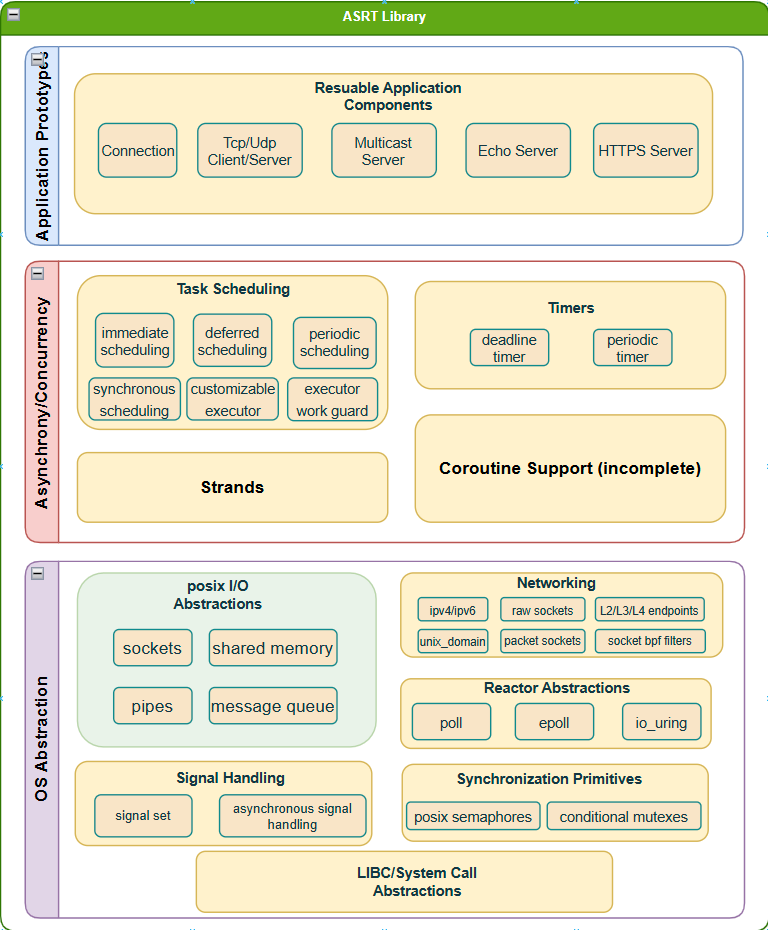
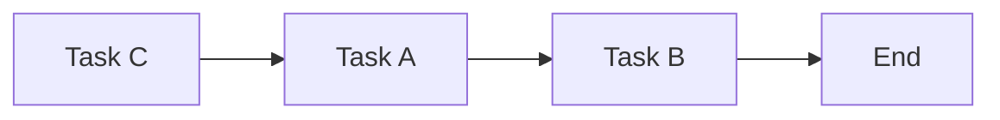
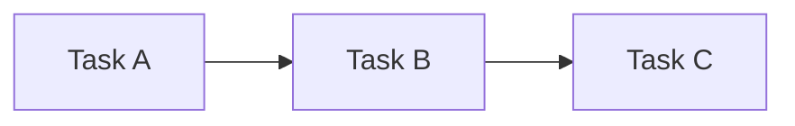
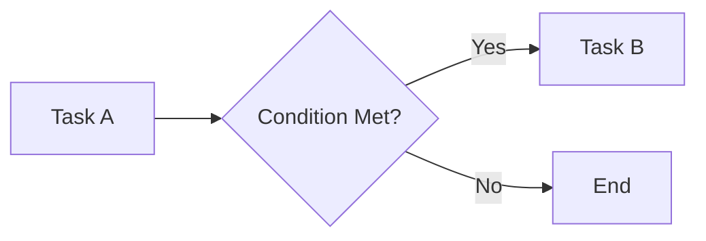
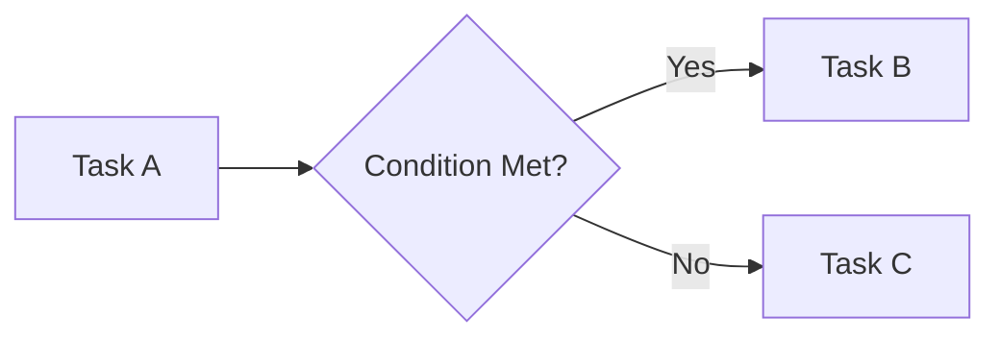
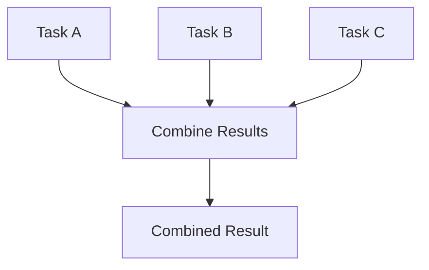
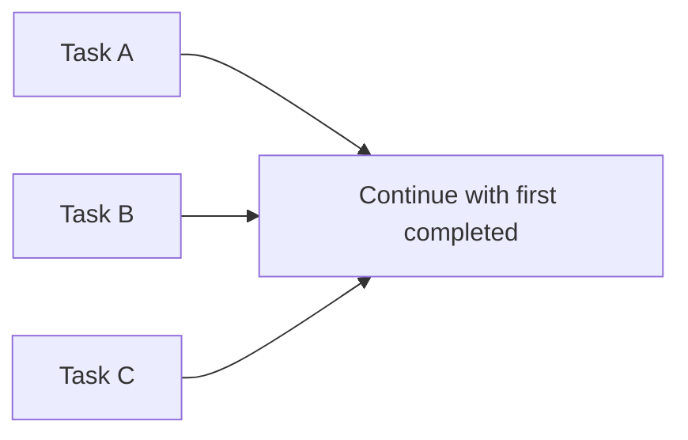
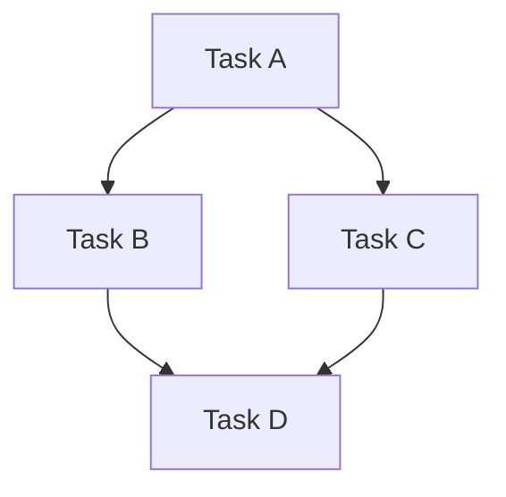
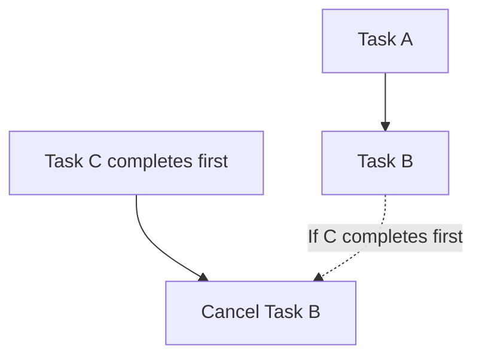

# `ASRT`
> An open source task scheduling library ASRT (Async Runtime) written in modern C++ tailored for embedded linux systems. 

`ASRT` is a header-only C++ **concurrency/networking** library that makes writing performant and safe embedded applications a breeze.  Implementations of a task scheduler and C++ abstractions for posix objects like sockets and pipes are provided out of the box. If you are comfortable with C++11 or above and have written networking applications, you are good to go! No more awkward wrappers over raw system calls and manual event loops in your otherwise structured (I hope) C++ program. 

## New in V1.2.0!
Now you can [compose tasks](#task-composition) before scheduling them for execution! See below for a sneak peek of this new feature.

```c++
#include <iostream>
#include <asrt/asrt.hpp>
#include <asrt/composable_task.hpp>

int main() {

	// Compose tasks using the then() method
	auto cpmposed_task = asrt::Task{[] {
		std::cout << "Task 1 executed." << std::endl;
		return 42;
	})
	| then([](int value) {
		std::cout << "Task 2 executed with value: " << value << std::endl;
		return value * 2;
	})
	| then([](int value) {
		std::cout << "Task 3 executed with value: " << value << std::endl;
	}};

	// Post the composed task to the global default scheduler
	asrt::Post(std::move(composedTask));

	// The composed task will be executed here
	asrt::Run();

	return 0;
}
```
Please refer to the [Task Composition](#task-composition) section for a detailed introduction to the various ways to express dependency relationships between tasks and the underlying implementation that makes this possible, 

## Table of Contents
* [Why Another Task Scheduling Library?](#why-another-task-scheduling-library)
* [Architecture Overview](#architecture-overview)
	* [Os Abstraction](#os-abtstraction)
	* [Asynchrony/Concurrency](#asynchronyconcurrency)
	* [Application Prototypes](#application-prototypes)
* [Task Scheduling](#task-scheduling)
* [Task Composition](#task-composition)
 	* [Understanding Task Composability](#undestanding-task-composability) 
 	* [Task Dependencies](#task-dependencies)
   	* [Building Compile-Time Call Graphs](#building-compiletime-call-graphs)
	* [The Executor](#the-executor)
	* [Executor Work Guard](#executor-work-guard)
* [Os Abstractions](#os-abstractions)
	* [Synchronous Socket I/O](#synchronous-socket-io)
	* [Asynchronous Socket I/O](#asynchronous-socket-io)
	* [The Reactor](#the-reactor)
	* [Synchronous Signal Handling](#synchronous-signal-handling)
* [Client Server Interfaces](#client-server-interfaces)
	* [Asynchronous Tcp Client](#asynchronous-tcp-client)
	* [Asynchronous Udp Server](#asynchronous-udp-server)
* [Using the Library](#using-the-library)

## Why Another Task Scheduling Library?

Although task libraries abound in C++, with [Boost::Asio](https://github.com/boostorg/asio),  Intel's [TBB](https://github.com/oneapi-src/oneTBB) and of course, NVDIA's [stdexec](https://github.com/NVID(https://man7.org/linux/man-pages/man7/packet.7.html)IA/stdexec) that is on course for standard shipment with C++26, there seems to be a void in development of a task scheduler that's written specifically with embedded applications in mind. ASRT fills that void. 

The design objectives of ASRT are as follows:

 - **Safety**. Safety always comes first in embedded applications. The ability of a piece of software to correctly function for extended periods of time without crashing or stalling is especially criticial In fields such as medical equipments and autonomous vehicles. `ASRT` is designed with a robust error handling and tracing mechanism. Users are shielded from directly interacting with the operation system. We use RAII abstractions over raw system resources whenever possible. All systems calls are traceable and systems erros are never ignored (either internally handled or passed on to the user). The library does not start or manage any threads whatsoever and that responsibility is left solely to the user. [**Synchronous signal handling**](#synchronous-signal-handling)  is supported (with kernel verison > Linux 2.6.22) so that signals are handled gracefully and do not disrupt the normal program flow.
 
 - **Performance**.  We understand the importance of performance to any C++ programmer ; ) As modern embedded applications become increasingly complex and increasingly inter-connected, the need for an efficient and low-latency task schedulign and networking framework is criticial is ever more important. Throughout the entire framework,  expensive operations such as virtual function callss and dynamic allocations are avoided whenever posssible. **Compile-time computations** are preferred over run-time ones. **Static polymorphism** are utilised in place of run-time polymorphism. Use zero-cost/low-cost abstractions whenever possible. Benchmarks are regularly executed on differnt platforms and with differnt compilers. 
 
 - **Resources**. Memory resources are often limited in embedded applications. `ASRT` understands this and avoids dynamic allocation at all costs. When that is not possible, `ASRT` gives users the abillity to integrate their **custom memory allocation** schemes into the framework through injecting a`std::pmr::allocator` (available with C++17)  when constructing entites such as `asrt::Executor` and `asrt::BasicSocket`. These objects are said to be *allocator-aware* as they understand and can work with user-defined *memory resources* rather than always calling `new` and `delete`. Using allocators is of cource not mandatory. All `ASRT` objects can work without alloators, in which case they just default to using the global `new` and `delete` when dynamically allocating.


 - **Extensibility** Objects like `asrt::Executor` and `asrt::BasicSocket` are designed to be easily customized and extended. These base types are designed as [CRTP](https://en.wikipedia.org/wiki/Curiously_recurring_template_pattern) interfaces to be extended by derived classes. For example. if you want to implement a custom [UDP-Lite](https://en.wikipedia.org/wiki/UDP-Lite) socket, you can implement `asrt::BasicSocket`'s CRTP interface without having to write everything from scratch since the logic for opening. binding, and closing the sockets are entirely reusable. In fact, sockets like `asrt::BasicStreamSocket` and `asrt::BasicDatagramSocket` are exactly implemented by implementing the same `asrt::BasicSocket` interface. You can also see an example in the library of an implementation of a [packet socket](https://man7.org/linux/man-pages/man7/packet.7.html) called `asrt::BasicPacketSocket`that gives you an idea of you might want to implement your own socket. 


## Architecture Overview
The core components of the `ASRT` library can be logically grouped into three layers. 



### Os Abtstraction
At the very bottom, there is the *Os Abtstraction* layer that implements abstractions towards APIs/objects provided by or used to interact with the operation system. ASRT implements abstractions over communication objects such as `asrt::BasicSocket` and `asrt::BasicNamedPipe` on top of their posix equivalents. Another core component in this layer is the `asrt::Reactor` abstraction, which implemenmts the [reactor design pattern](https://en.wikipedia.org/wiki/Reactor_pattern). A reactor is a device that encapasulates a dedicated event loop that repeatedly calls `poll()`, `epoll_wait()`or `io_uring_enter()`and dispatches the reaped i/o events from those calls. Without native support on Linux for asynchronous i/o such as that provided by Window's overlapped i/o, a reactor is needed to emulate asynchrony. All ASRT i/o objects such as `asrt::BasicStreamSocket` and `asrt::BasicNamedPipe` support asynchronous i/o through underlying reactor. 

### Asynchrony/Concurrency
In this layer, asynchronous task scheduling is implememted through abstractions such as `asrt::Executor`. From a high-level view, an *executor* is simply a combination of task storage and execution policy. Tasks are function callables that are submitted by user for execution to the executor. Execution policy controls the how (can tasks be executed in parrallel), when (execute now or some time later) and where (which thread to execute the task on) the execution takes place. ASRT also implements *timer* abstractions   such as `asrt::BasicWaitableTimer` and `asrt::BasicPeriodicTimer` which enable delayed or periodic task scheduling. They can also be used as standalone objects that enable custom timer expiry handling. *Strands* are another useful abstraction provided by the library that simplifies task synchronization in multithreaded use cases. By enqueuing mutually exclusive tasks in a `asrt::Strand`, you avoid needing to manually syncrhonize the tasks to prevent concurrent execution. 

### Application Prototypes
At the highest level, ASRT provides out-of-the-box implementation of reusable application components such as the `asrt::TcpConnection`and  `asrt::UnixStreamConnection`, which are simply different template instantiations of the same `asrt::Connection` base type. Interfaces such `asrt::ClientInterface` and `asrt::ServerInterface`can also be inherited/encapsulated by user implementations to enable typical client-server use cases.


## Task Scheduling
Scheduling tasks is as easy as calling the global api `asrt::Post()` , which signals the underlying global default `asrt::Executor` to schedule your callable for immediate asynchronous execution (synchronous execution is also possible, although rarely desired). Variants of the `Post()` are also provided, ie: `asrt::PostDeferred()` and `asrt::PostPeriodic()`, if you need delayed or repeated executions. You can easily customize the executor by instantiating your own executor with desired template parameters, which control the execution policy and service providers (more on this later), and replacing the global executor with your custom one. The executor event loop need to be run on its own thread (separate from the main application thread from which tasks are posted) by calling `Run()` on the executor for asynchronous task scheduling. 

The following program posts user tasks to the gloabl executor for execution under different conditions. 
```c++
#include <iostream>
#include <chrono>
#include <thread>
using std::chrono_literals;
	
int user_task_func()
{
    std::cout << "What is the answer?\n";
}

int main(int argc, const char* argv[])
{	
    // post the function pointer to the gloabl default executor for immediate execution
    asrt::post(user_task_func);

    // schedule the lambda for delayed execution
    int const answer = 42;
    asrt::post_deferred([answer](){
		std::cout << "The answer is " << answer << "\n";
    }, 42ms);

    // schedule function for periodic execution
    asrt::post_periodic(user_task_func, 42ms);
	
	// run the executor on separate thread. This is where tasks will be executed.
	std::thread t{[]{ asrt::Run(); }}；
	t.join();
}
```

## Task Composition


The ability to effectively manage and execute asynchronous tasks is crucial for building responsive, efficient, and scalable systems. The **Task Composition** feature avaiable in `ASRT V1.2.0` allows you to easily define, chain, and manage tasks with fine-grained control over execution flow and call dependencies. 

### Understanding Task Composability

**Task Composition** refers to the process of combining multiple tasks into a single, cohesive operation where each task can build upon the result of the previous one. Suppose we have two tasks: Task A and Task B and we want to combine them in to a new task called Task C such that when Task C is executed, it invokes TaskA and TaskB sequentially, in that order. 


Suppose Task A returns a value. Now Task B can work with that value and it too can return a value for the next Task to work with.  This is akin to creating an execution pipeline where the output of one task becomes the input of the next. Task composition is invaluable in scenarios where complex workflows need to be broken down into smaller, manageable units that can be executed sequentially or conditionally, based on the needs of the application.

In `ASRT`,  task composition is simplified through an intuitive interface that allows tasks to be chained together using **composers** like `let(), then(), split(), etc.` and the pipe operator `|`. 

You can now write code like this
```c++
	auto task = just(42)
	| then([](int value) { return value * 2; })
	| then([](int value) { return value + 42; }}
	| then([](int value) { return value / 3; }}
	| then([](int value) { return value; }};
```

This not only makes the code more readable but also ensures that tasks are executed in the correct order, with minimal overhead.

###  Task Dependencies

**Task dependencies** describe the relationships between tasks where the execution of one task depends on the side-effects of another. For example, in a data processing pipeline, Task B might need to wait for the result of Task A before it can proceed. You can express these dependency relationships in `ASRT` using **composer functions** such as  `then_if` (conditional continuation), `when_all` ( parallel task execution), or even alternative execution paths based on runtime conditions. Let's explore some of these dependency relationships between tasks and how to express them in code. 

####  **Sequential Composition**

In this scenario, Task B depends on Task A, and Task C depends on Task B.


- **Example**
Lets's compose a task based on the above call dependency.

```c++
	Task task_a{};
	Task task_b{};
	Task task_c{};
	
	auto composed_task = just(42）
		| let([](int value) { return value * 2; })
		| let([](int value) { return value + 42; }}
		| let([](int value) { return value / 3; }}
		| let([](int value) { return value; }};
```

#### Conditional Continuation 

Here, Task B is executed only if a condition based on the result of Task A is met.


- **Example**
```cpp
auto task_a = just(42);

//the condition does not depend on task_a's result
auto task_b = task_a 
	| if_then([] { return true; }, 
		[](int value) {
			//this will be executed since condition is satisfied
			return value * 2;
		});

//the condition depends on task_a's result
auto task_b = task_a
	| then_if([] (int result) { return result > 100; }, 
		[](int value) {
			//this will never be executed since condition is not satisfied
			return value * 2;
		});
```
#### Conditional Execution (Example 2)
Now, either Task B or Task C will be executed based on the condition.


- **Example**
```cpp
auto task_a = just(42);

//the condition does not depend on task_a's result
auto task_b = task_a |
	if_then_else([] { return true; }, 
		[](int value) {
			//this will always be executed since condition is always satisfied
			return value * 2;
		},
		[](int value) {
			//this will never be executed
			return value / 2;
		});
	
//the condition depends on task_a's result
auto task_b = task_a
	| then_if_else([] (int result) { return result > 100; }, 
		[](int value) {
			//this will always be executed since condition is always satisfied
			return value * 2;
		},
		[](int value) {
			//this will never be executed
			return value / 2;
		});
```

#### Parallel Execution

Executes multiple tasks in parallel and continues once all tasks have completed. The result is a tuple of all the results.


- **Example**
```cpp
auto combinedTask = when_all(task_a, task_b, task_c) 
	| then([](auto results) {
		// Process results from all tasks
	});
```

#### First Completed Task

 Executes multiple tasks in parallel and continues as soon as the first task completes. The result is the result of the first completed task.



- **Example**:

```cpp
auto firstTask = when_any(task_a, task_b, task_c)
	| then([](auto result) {
	    // Process the result of the first completed task
	});
```

#### Complex Dependencies

Suppose we want to execute Task A then Task B and Task C, and finally Task D, but only after Task B and C completes execution.


- **Example**
```cpp
auto task = just(42)
	| split(
		[](int value) { return 42 / 2; },
		[](int value) { return 42 * 2; }
	)
	| when_all([](auto values){
		auto [val_b, val_c] = values;
		return val_c - val_b * 2;
	});
```
#### 7. **Delayed Execution


- **Example**

#### Cancellation 


- **Example**


### Building Compile-Time Call Graphs

One of the most powerful aspects of task composition is the ability to **build call graphs at compile time**. A call graph represents the sequence and dependencies of function calls in a program. By constructing these graphs at compile time, powerful compile time optimizations are enabled, such as eliminating unnecessary runtime checks, improving execution speed, and reducing memory usage.

With our `constexpr`-friendly implementation, tasks can be composed and evaluated at compile time. This means that in certain scenarios, entire task chains can be resolved before your program even runs, leading to highly efficient execution with predictable performance characteristics. This is particularly useful in embedded systems or performance-critical applications where every cycle counts.

### Why These Features Matter

The ability to compose tasks, manage dependencies, and optimize execution at compile time offers several key benefits:

- **Improved Readability and Maintainability**: Task composition provides a clear, linear way to express complex workflows, making your code easier to read and maintain.

- **Deterministic Execution**: By explicitly defining dependencies, you ensure that tasks execute in the correct order, reducing bugs and unpredictable behavior.

- **Performance Optimization**: Compile-time call graphs and `constexpr` task chains eliminate runtime overhead, resulting in faster, more efficient code.

- **Scalability**: As your system grows, these features allow you to manage increasingly complex task interactions without sacrificing performance.

#### Brief Overview of the Implementation

The composability feature in our scheduler is implemented using a `ComposableTask` class, which supports chaining operations through operator overloading (e.g., the `|` operator for continuations). Each `ComposableTask` object represents a callable that can be composed with others to form a task chain. These tasks are `constexpr` friendly, allowing for compile-time optimization when possible.

To handle dependencies, we offer a suite of functions like `then_if`, `when_all`, and `schedule_after`, which allow you to express complex execution flows with minimal boilerplate. Additionally, our use of templates ensures that these tasks can be evaluated at compile time, leading to efficient, optimized execution in your final application.

### The Executor
The `asrt::Executor` is a core abstraction of the `ASRT` library. It handles task submission, task scheduling and task execution. By default, the first time when you call the `asrt::Post() ` API, a default global `asrt::Executor` instance is created and you can interact with this executor through global APIs like `asrt::GetDefaultExecutor()` and `asrt::PostDeferred()`. However, you may not always want a singleton executor lying around in your program. You can always create a local executor at block scope and pass its reference to any `ASRT` objects that require it. 

Below is an example of how you might create a local executor and use it to initialize a socket.

```c++
#include <asrt/ip/tcp.hpp>

int  main() {
	
	// construct a local executor object	
	asrt::ip::tcp::Executor executor;
	
	// initialize the tcp socket with the executor to enable async io
	asrt::ip::tcp::Socket tcp_socket{asrt::ip::tcp::V4(), executor};
	
}
```

#### Executor Work Guard

When an executor runs out of tasks to execute (or is never given tasks to begin with), it returns from the `Run()`call and exits the execution loop. In cases where:
```c++
	std::thread t{[&executor](){
		executor.Run();
	}};
```
that thread will exit as well. In order to prevent this from happening, you can give the executor a dummy job that never completes to keep it busy (busy in the sense that it blocks waiting for the task completion rather than busy-waiting). Here's how you might want to use it.

```c++
	std::thread t{[&executor](){ 
		asrt::ExecutorNS::WorkGuard dummy_work{executor};
		executor.Run();
	}};
```
Essentially, it's a RAII object that notifies executor of job arrival on construction and 
job completion on object destruction.

## OS Abstractions
The library also provides a full os-abstraction layer towards the Linux kernel. All system calls made to the kernel need to go through an *os_abstraction* layer that logs all interactions with the underlying os, through calls such as: 
```c++
asrt::OsAbstraction::Socket(asrt::tcp::Protocol(), SOCK_CLOEXEC); //calls posix ::socket()
```

`ASRT` gives you object-oriented, extensible RAII abstractions over posix i/o objects , such as `asrt::BasicSocket`, `asrt::BasicUnnamedPipe`and `asrt::BasicSharedMemory`. Common sockets types such as `tcp::Socket`, `udp::Socket` and `unix::StreamSocket`, `unix::DatagramSocket` are already implemented and are ready to use. You can easily extend the basic abstractions to create custom abstractions taillored to your specific application needs. You will find an example implementation in `asrt::BasicPacketSocket`of a L2 packet socket by extending the `asrt::BasicSocket`. 

### Synchronous Socket I/O


The following program creates and opens a tcp socket and attempts connection to remote server synchronously. Error handling is omitted for simplicity.

```c++
#include <iostream>
#include <asrt/ip/tcp.hpp>

int main(int argc, const char* argv[])
{	
    // create a tcp socket and a server endpoint
    tcp::Socket tcp_socket;
	tcp::Endpoint server{"127.0.0.1", 50000u}; //asume we have a running tcp server listening at this local address
	
	// actually open the socket so that it's ready for communication
	tcp_socket.Open();
	
	// connect the socket to server endpoint
	tcp_socket.Connect(server);
	
    // send a message to server
    const char[] say_hi{"Hello server!"};
    std::cout << "Sending: " << say_hi << "\n";
    tcp_socket.SendSync(server, say_hi);

    // perform a blocking receive from server
    char server_response[4096];
    tcp_socket.ReceiveSync(server_response);

	std::cout << "Server replied with " << "server_response" << std::endl;
}
```

### Asynchronous Socket I/O

The following program creates and opens a tcp socket and attempts connection to remote server asynchronously. Error handling is omitted for simplicity.

```c++
#include <iostream>
#include <asrt/asrt.hpp>
#include <asrt/ip/tcp.hpp>

int main(int argc, const char* argv[])
{	
    // create a tcp socket and a server endpoint
    tcp::Socket tcp_socket{asrt::GetDefaultExecutor()};
	tcp::Endpoint server{"127.0.0.1", 50000u}; //asume we have a running tcp server listening at this local address
	
	// actually open the socket so that it's ready for communication
	tcp_socket.Open();
	
	// connect the socket to server endpoint
	tcp_socket.Connect(server);
	
    // send a message to server
    const char[] say_hi{"Hello server!"};
    std::cout << "Sending: " << say_hi << "\n";
    tcp_socket.SendSync(server, say_hi);

    // perform a blocking receive from server
    char server_response[4096];
    tcp_socket.ReceiveSync(server_response);

	std::cout << "Server replied with " << "server_response" << std::endl;
}
```

### The Reactor

***
### Synchronous Signal Handling

Posix signals are **asynchronous** by nature, ie:  they can be delivered to a process at any point in time, interrupting the normal flow of the program's execution. 

Because of their asynchronous nature, signals introduce challenges in handling them safely and correctly. In traditional signal handling schemes, we either have to 

 1. install a gloabl signal handler 
 2. dedicate a thread to capturing and handling signals

If we go with method 1, we need to be extra careful we do not introduce race conditions or leave the program in an inconsistent state.  Method 2 is a lot safer though there's the added complexity of threading and with threading you almost always have to synchronize. Linux is unique among posix systems in that it implements a **synchronous** signal handling interface revolved around [signalfd](https://www.man7.org/linux/man-pages/man2/signalfd.2.html).  Here's an excellent [article](https://unixism.net/2021/02/making-signals-less-painful-under-linux/) that compares asynchronous and synchronous signal handling and makes the case for the latter. 

`ASRT` gives you the ability to take advantage of this unique Linux feature by introducing an abstraction called the `asrt::BasicSignalSet` that allows you to install a signal handler that is invoked synchronously by the `asrt::Executor`.

The below example masks out all signals execept `SIGABRT` and `SIGFPE` for the current thread and asynchronously waits for incoming `SIGINT` and `SIGTERM` signals.

```c++
#include <csignal>
#include <iostream>
#include <asrt/reactor/epoll_reactor.hpp> 
#include <asrt/executor/io_executor.hpp>  
#include <asrt/sinalset/basic_signalset.hpp>  

using namespace asrt;

int  main()  { 
	ExecutorNS::Io_Executor<ReacorNS::EpollReactor> executor;
	BasicSignalSet signal_set{executor};
	
	signal_set.Fill();
	
	signal_set.Remove(SIGABRT, SIGFPE);
	
	asrt::SetCurrentThreadMask(signal_set)
	
	signal_set.Clear();
	
	signal_set.Add(SIGINT, SIGTERM);
	
	signal_set.WaitAsync([](int signal){
		if(SIGINT == signal){
			std::cout << "Caught SIGINT\n";
			//handle signal here
		}else if(SIGTERM == SIGNAL){
			std::cout << "Caught SIGINT\n";
			//handle signal here
		}else{
			std::cout << "Unexpected signal number " << signal << "\n";
			//handle signal here
		}
	});  
}
```

## Client Server Interfaces

You can easily rapid-prototype your networking application using resuable application components provided by `ASRT`such as the `asrt::ClientInterface` and `asrt::ServerInterface`.  For example, to create a tcp client, you just need to inheir from the interface and provide concret implementations for the `OnMessage()` and `OnServerDisconnect()`API while the rest of the connection and I/O logic is already provided and ready to use;

In the following program we will implement an tcp client that performs asynchronous i/o with the remote server.

### Asynchronous Tcp Client
```c++
#include <iostream>
#include <asrt/asrt.hpp>
#include <asrt/ip/tcp.hpp>
#include <asrt/client_server/client_interface.hpp>

class AsyncTcpClient : asrt::ClientInterface {

};

int main(int argc, const char* argv[])
{	
    // create a tcp socket and a server endpoint
    tcp::Socket tcp_socket{asrt::GetDefaultExecutor()};
	tcp::Endpoint server{"127.0.0.1", 50000u}; //asume we have a running tcp server listening at this local address
	
	// actually open the socket so that it's ready for communication
	tcp_socket.Open();
	
	// connect the socket to server endpoint
	tcp_socket.Connect(server);
	
    // send a message to server
    const char[] say_hi{"Hello server!"};
    std::cout << "Sending: " << say_hi << "\n";
    tcp_socket.SendSync(server, say_hi);

    // perform a blocking receive from server
    char server_response[4096];
    tcp_socket.ReceiveSync(server_response);

	std::cout << "Server replied with " << "server_response" << std::endl;
}
```

### Asynchronous Udp Server

In contrast with the previous example, we do not directly inherit from the interface class. Rather, we **encapsulate** the server interface inside our udp server class. We instantiate the server interface template class by supplying our message handler as a template parameter. This avoids the overhead that comes with virtual function calls as seen in the previous example.

```c++
#include  <span>
#include  <iostream>
#include  <asrt/socket/basic_datagram_socket.hpp>
#include  <asrt/ip/udp.hpp>
#include  <asrt/client_server/datagram_server.hpp>

using namespace asrt::ip;

class AsyncUdpServer {
	AsyncUdpServer(udp::Executor& executor, udp::Endpoint const& address)
		: server_{executor, address, *this} {}

	void OnMessage(udp::Endpoint  const&  peer, ClientServer::ConstMessageView  message){
		std::cout << "Received: " << message.data() //asume message is a string
		          << "from " << peer.Address().ToString() << "\n"; 
	}

	using Server = asrt::ClientServer::DatagramServer<
		udp::Executor, 
		udp::ProtocolType, 
		AsyncUdpServer, 
		1500, 
		&AsyncUdpServer::OnMessage>;

	Server server_;
};

int  main() {

	udp::Executor executor;

	udp::Endpoint ep{udp::v4(), 50000u};

	AsyncUdpServer server{executor, ep};
	
	executor.Run();

}
```

## Using the library
The library is regularly tested on on the following platforms:
* Linux with g++ 9.4.0 or newer

Currently, the library requires a C++17-capable compiler. Work in currently underway to port the project to C++11/C++14.

There are different ways to integrate the library into your existing project. The easiet way is simply copying the `asrt/` subfolder into your `include/` or `lib/`directory. 

An example of integration with CMake is given in the `examples/` folder.
